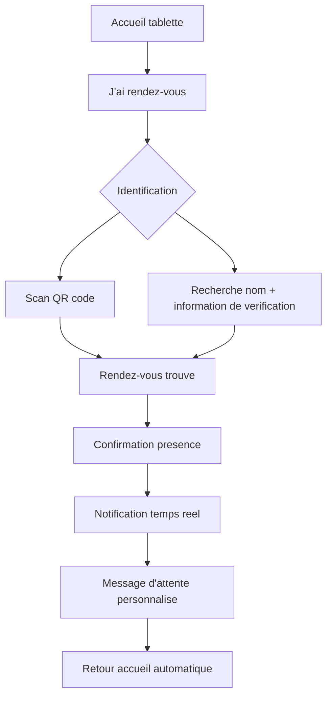
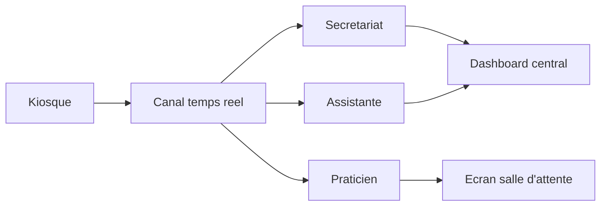
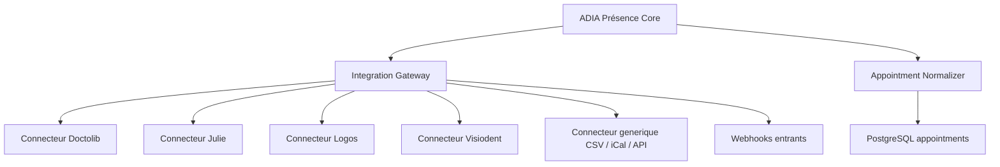
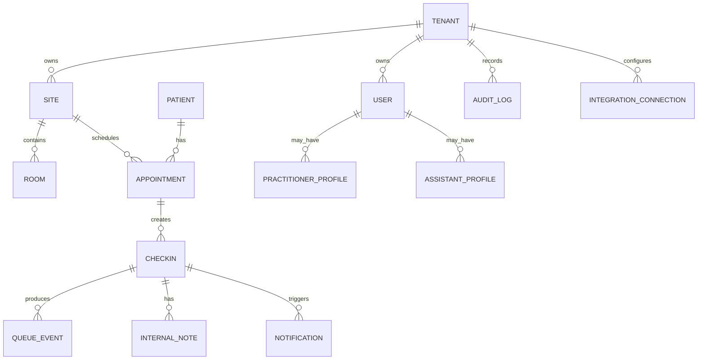

# ADIA Présence - Dossier de conception produit et technique

Version: 0.1  
Date: 31 mai 2026  
Statut: cadrage produit, fonctionnel, UX et architecture avant developpement

## 0. Positionnement executif

ADIA Présence est une plateforme SaaS multi-cabinets destinee aux cabinets dentaires, centres dentaires et groupes multi-sites. Son objectif n'est pas simplement de remplacer une sonnette d'accueil, mais de creer un systeme complet de gestion des arrivees, de circulation patient, de coordination interne et d'analyse operationnelle.

Le produit doit couvrir quatre surfaces principales:

- une application tablette en mode kiosque pour l'accueil autonome;
- un centre de controle temps reel pour secretariat et coordination;
- des espaces metiers pour praticiens et assistantes;
- des modules d'administration, statistiques, securite et integrations.

Le niveau cible est commercial, deployable en conditions reelles, avec des exigences de disponibilite, tracabilite, confidentialite, accessibilite et extensibilite compatibles avec un usage professionnel en environnement de sante.

## 1. Sources reglementaires et securite prises en compte

Ce dossier ne remplace pas une validation juridique par un DPO ou un avocat specialise, mais il integre les exigences structurantes suivantes:

- Donnees de sante: les donnees de sante personnelles sont sensibles et leur hebergement externalise doit s'appuyer sur un hebergeur certifie HDS selon l'Agence du Numerique en Sante. Source: [ANS - Certification HDS](https://esante.gouv.fr/ens/offre/hds).
- Evolution HDS: le referentiel HDS revise introduit des exigences applicables aux nouveaux candidats depuis le 16 novembre 2024 et aux hebergeurs deja certifies au plus tard le 16 mai 2026. Source: [ANS - publication referentiel HDS](https://esante.gouv.fr/espace-presse/publication-au-journal-officiel-du-referentiel-de-certification-hds-souverainete-des-donnees-et-ameliorations-du-referentiel).
- Externalisation: le portail G_NIUS rappelle que la certification HDS est obligatoire des lors que des donnees de sante sensibles sont externalisees. Source: [G_NIUS - certification HDS](https://gnius.esante.gouv.fr/fr/a-la-une/actualites/simplificaction-la-certification-hds-decryptee).
- Securite applicative: la conception doit s'aligner sur OWASP ASVS pour l'architecture, l'authentification, le controle d'acces, la journalisation et la verification applicative. Source: [OWASP ASVS](https://devguide.owasp.org/en/06-verification/01-guides/03-asvs/).

## PHASE 1 - Analyse metier, etude fonctionnelle, cahier des charges

### 1.1 Enjeux metier

Les cabinets dentaires combinent des flux humains rapides, des contraintes d'horaire, une forte sensibilite relationnelle et des donnees personnelles sensibles. L'accueil conditionne l'image du cabinet, la ponctualite de la journee, le stress des equipes et la qualite percue par le patient.

ADIA Présence doit repondre a six enjeux:

- fluidifier l'arrivee des patients sans dehumaniser l'accueil;
- reduire les interruptions du secretariat;
- synchroniser secretariat, praticiens, assistantes et salles;
- rendre visible l'etat du flux patient en temps reel;
- produire des indicateurs fiables d'attente, retard et charge;
- garantir la confidentialite et la conformite.

### 1.2 Perimetre fonctionnel cible

Le produit couvre les domaines suivants:

- accueil patient et visiteur;
- identification par rendez-vous, recherche ou QR code;
- notification interne temps reel;
- gestion de files d'attente par praticien, salle, motif et statut;
- coordination praticien-assistante-secretariat;
- ecran de salle d'attente preservant la confidentialite;
- administration du cabinet, des sites, utilisateurs, roles et droits;
- statistiques operationnelles;
- audit, consentements, export et suppression des donnees;
- architecture d'integration avec agendas et logiciels metier;
- socle futur pour analyse predictive.

### 1.3 Objectifs mesurables

Objectifs operationnels:

- reduire de 50 a 80 % les interruptions simples au secretariat liees aux arrivees;
- notifier une arrivee en moins de 2 secondes aux postes concernes;
- permettre a un patient standard de confirmer sa presence en moins de 30 secondes;
- afficher l'etat d'un patient sur tous les ecrans connectes en moins de 1 seconde apres changement de statut;
- tracer 100 % des actions sensibles;
- isoler strictement les donnees entre cabinets.

Objectifs experience:

- interface kiosque utilisable par senior, enfant accompagne ou personne peu technophile;
- aucun libelle technique visible pour le patient;
- langage simple, rassurant, professionnel;
- contraste et lisibilite compatibles avec accessibilite WCAG 2.2 AA comme cible produit;
- retour systematique apres action: confirmation visuelle, sonore optionnelle, message clair.

### 1.4 Acteurs

- Patient avec rendez-vous;
- Patient sans rendez-vous ou urgence;
- Visiteur externe;
- Livreur;
- Representant commercial;
- Technicien;
- Secretaire;
- Assistante;
- Praticien;
- Responsable de cabinet;
- Administrateur multi-site;
- Super administrateur SaaS;
- Support ADIA Présence.

### 1.5 Parcours tablette - exigences

La tablette doit fonctionner comme une borne:

- application plein ecran;
- retour automatique a l'accueil apres inactivite;
- prevention de la navigation hors application;
- aucune information patient persistante visible apres session;
- gros boutons tactiles;
- clavier adapte;
- parcours court;
- langue configurable;
- gestion d'erreur claire;
- mode degrade si reseau indisponible.

Parcours disponibles:

- J'ai rendez-vous;
- Je viens voir un praticien;
- Je viens voir une assistante;
- Je viens voir le secretariat;
- Livraison;
- Representant commercial;
- Intervention technique;
- Autre visite;
- Urgence dentaire si le cabinet l'active.

Moyens d'identification:

- QR code de confirmation;
- recherche par nom + date de naissance ou telephone selon politique cabinet;
- selection d'un praticien ou service;
- saisie libre visiteur;
- saisie assistee avec rendez-vous du jour.

Validation:

- creation d'un evenement d'arrivee;
- horodatage;
- rattachement a cabinet, site, agenda, praticien, motif;
- notification immediate;
- retour a l'accueil.

### 1.6 Tableau de bord central - exigences

Vue temps reel pour secretariat et coordination:

- patients arrives;
- en attente;
- appeles;
- pris en charge;
- termines;
- absents;
- retards patient;
- retards praticien;
- visiteurs externes;
- salles occupees;
- charge par praticien.

Actions:

- appeler un patient;
- changer un statut;
- transferer vers un praticien, une assistante, une salle ou le secretariat;
- ajouter une note interne;
- envoyer une notification ciblee;
- marquer absent;
- fusionner une arrivee avec un rendez-vous;
- creer une arrivee manuelle;
- filtrer par site, praticien, statut, salle, motif.

### 1.7 Espace praticien - exigences

Chaque praticien voit:

- sa file d'attente;
- patients arrives;
- rendez-vous a venir;
- retards;
- priorites;
- notes internes visibles selon droits;
- historique de journee.

Actions:

- appeler le patient;
- marquer pris en charge;
- marquer termine;
- demander preparation assistante;
- envoyer message au secretariat;
- signaler retard;
- demander changement de salle;
- consulter indicateurs personnels.

### 1.8 Espace assistante - exigences

L'assistante doit pouvoir:

- voir les patients arrives par praticien;
- voir les besoins de preparation;
- etre notifiee quand un patient est pret;
- signaler preparation terminee;
- coordonner salle et praticien;
- ajouter une note interne;
- suivre les alertes de retard ou conflit.

### 1.9 Espace secretariat - exigences

Le secretariat dispose d'une vue globale et d'outils d'administration operationnelle:

- utilisateurs;
- praticiens;
- assistantes;
- horaires;
- salles;
- motifs;
- files;
- parametres tablette;
- messages d'accueil;
- contenu salle d'attente;
- statistiques;
- exports.

### 1.10 Ecran salle d'attente - exigences

L'ecran optionnel doit:

- afficher des appels patient sans exposer le nom complet si le cabinet choisit le mode confidentiel;
- utiliser prenom + initiale, numero de ticket, ou message personnalise;
- afficher des informations cabinet;
- diffuser contenus educatifs;
- afficher retards generaux sans cibler de patient;
- fonctionner en mode presentation plein ecran.

### 1.11 Exigences non fonctionnelles

Performance:

- latence notification cible: moins de 2 secondes;
- temps chargement dashboard cible: moins de 2 secondes en usage courant;
- support 100 cabinets sur architecture initiale scalable;
- pagination, filtrage et indexation systematiques.

Disponibilite:

- objectif SaaS: 99,9 % en V1 commerciale;
- reprise apres incident documentee;
- sauvegardes quotidiennes minimum;
- surveillance applicative et infrastructure.

Securite:

- chiffrement TLS;
- chiffrement donnees sensibles au repos;
- JWT courts + refresh tokens rotatifs;
- RBAC granulaire;
- audit trail immuable applicativement;
- protection anti-CSRF selon surface;
- rate limiting;
- detection de session suspecte;
- isolation tenant par conception et controle systematique.

Conformite:

- minimisation des donnees;
- retention parametrable;
- export cabinet;
- suppression/anonymisation;
- registre des traitements;
- gestion sous-traitance;
- choix d'hebergement HDS pour donnees de sante reelles.

## PHASE 2 - Personas, user stories, cas d'utilisation, parcours

### 2.1 Personas

#### Persona 1 - Patient senior

Nom: Madeleine, 74 ans  
Besoin: confirmer son arrivee sans stress.  
Risque: mauvaise lecture, peur de se tromper, gestes lents.  
Exigence UX: gros boutons, texte court, confirmation rassurante, assistance humaine toujours possible.

#### Persona 2 - Parent avec enfant

Nom: Thomas, 39 ans  
Besoin: enregistrer l'arrivee de son enfant rapidement.  
Risque: enfant impatient, situation bruyante.  
Exigence UX: parcours court, choix clair "Rendez-vous pour moi / pour mon enfant".

#### Persona 3 - Secretaire

Nom: Sofia, 31 ans  
Besoin: voir qui est arrive sans interrompre les appels.  
Risque: surcharge cognitive, erreurs de statut.  
Exigence UX: dashboard dense mais lisible, alertes utiles, actions en un clic.

#### Persona 4 - Praticien

Nom: Dr Martin, 45 ans  
Besoin: savoir qui attend et appeler au bon moment.  
Risque: perdre du temps entre deux soins.  
Exigence UX: file d'attente claire, notifications discretes, actions rapides.

#### Persona 5 - Assistante

Nom: Lina, 27 ans  
Besoin: preparer salle et patient au bon moment.  
Risque: mauvaise coordination avec praticien.  
Exigence UX: priorites, statut salle, alertes contextuelles.

#### Persona 6 - Responsable multi-sites

Nom: Claire, 48 ans  
Besoin: piloter plusieurs cabinets et mesurer la qualite de service.  
Risque: donnees heterogenes, manque d'indicateurs comparables.  
Exigence UX: statistiques multi-sites, exports, droits par site.

### 2.2 User stories prioritaires

Kiosque:

- En tant que patient, je veux confirmer mon arrivee en quelques gestes afin que l'equipe sache que je suis present.
- En tant que visiteur, je veux indiquer la raison de ma venue afin d'etre oriente correctement.
- En tant que patient avec QR code, je veux scanner mon code afin d'eviter de saisir mes informations.
- En tant que cabinet, je veux personnaliser le message d'accueil afin de conserver mon identite.

Secretariat:

- En tant que secretaire, je veux voir les arrivees en temps reel afin de prioriser mon travail.
- En tant que secretaire, je veux modifier le statut d'un patient afin de garder le flux a jour.
- En tant que secretaire, je veux ajouter une note interne afin d'informer le praticien sans interrompre.

Praticien:

- En tant que praticien, je veux voir ma file d'attente afin de savoir qui prendre ensuite.
- En tant que praticien, je veux appeler un patient afin que l'ecran de salle d'attente l'informe.
- En tant que praticien, je veux signaler un retard afin que le secretariat adapte la communication.

Assistante:

- En tant qu'assistante, je veux voir les patients a preparer afin d'anticiper les soins.
- En tant qu'assistante, je veux notifier que la salle est prete afin d'accelerer la prise en charge.

Administration:

- En tant qu'administrateur cabinet, je veux gerer les utilisateurs et droits afin de securiser les acces.
- En tant que responsable, je veux exporter les statistiques afin d'analyser l'organisation.
- En tant que super administrateur, je veux gerer les cabinets clients sans acceder inutilement aux donnees de sante.

### 2.3 Cas d'utilisation principaux

UC-01 - Arrivee patient avec rendez-vous:

1. Le patient touche "J'ai rendez-vous".
2. Il scanne son QR code ou recherche son rendez-vous.
3. Le systeme identifie le rendez-vous du jour.
4. Le patient confirme.
5. Le statut passe a "arrive".
6. Le praticien, l'assistante et le secretariat sont notifies.
7. La tablette affiche une confirmation puis revient a l'accueil.

UC-02 - Patient introuvable:

1. Le patient recherche son rendez-vous.
2. Aucun resultat fiable.
3. Le systeme propose "Demander de l'aide au secretariat".
4. Une notification discrete est envoyee au secretariat.
5. La tablette affiche un message rassurant.

UC-03 - Visiteur externe:

1. Le visiteur choisit son motif.
2. Il selectionne une personne ou un service.
3. Il saisit nom, societe et message optionnel.
4. La personne ciblee est notifiee.
5. Le secretariat voit l'entree dans la file visiteurs.

UC-04 - Appel patient:

1. Le praticien clique "Appeler".
2. Le patient passe a "appele".
3. L'ecran salle d'attente affiche l'appel selon mode de confidentialite.
4. Le dashboard se met a jour.
5. Une entree d'audit est creee.

UC-05 - Fin de prise en charge:

1. Le praticien ou l'assistante marque "termine".
2. Le temps de prise en charge est calcule.
3. Le secretariat est notifie si un passage administratif est requis.
4. Les statistiques sont mises a jour.

### 2.4 Parcours utilisateur

Parcours patient rendez-vous:



Parcours coordination interne:



## PHASE 3 - Architecture logicielle, SaaS, securite, flux

### 3.1 Architecture applicative cible

Architecture recommandee:

- Frontend: Next.js, React, TypeScript, Tailwind CSS, ShadCN/UI;
- Backend: NestJS modulaire;
- Base: PostgreSQL;
- Cache et pub/sub: Redis;
- Temps reel: WebSocket via Socket.IO ou gateway NestJS;
- Authentification: JWT court + refresh token rotatif;
- Stockage: S3 compatible pour documents, exports et medias cabinet;
- Jobs: BullMQ avec Redis;
- Observabilite: OpenTelemetry, logs structures, metriques, traces;
- Deploiement: Docker Compose V1, preparation Kubernetes V2.

### 3.2 Decoupage backend NestJS

Modules:

- AuthModule;
- TenancyModule;
- UsersModule;
- RolesPermissionsModule;
- CabinetsModule;
- SitesModule;
- RoomsModule;
- PractitionersModule;
- AssistantsModule;
- AppointmentsModule;
- CheckInsModule;
- QueueModule;
- VisitorsModule;
- NotificationsModule;
- RealtimeModule;
- WaitingRoomDisplayModule;
- AnalyticsModule;
- IntegrationsModule;
- AuditModule;
- ConsentModule;
- DataExportsModule;
- RetentionModule;
- FilesModule;
- AdminModule.

### 3.3 Frontends

Applications ou zones Next.js:

- `/kiosk`: borne tablette;
- `/dashboard`: centre de controle;
- `/practitioner`: espace praticien;
- `/assistant`: espace assistante;
- `/admin`: administration cabinet;
- `/waiting-room`: ecran salle d'attente;
- `/super-admin`: administration SaaS interne.

### 3.4 Architecture multi-tenant

Mode recommande V1:

- base PostgreSQL unique;
- colonne `tenant_id` sur toutes les tables metier;
- isolation obligatoire par middleware applicatif;
- Row Level Security PostgreSQL a evaluer pour durcir l'isolation;
- index composes incluant `tenant_id`;
- audit systematique des acces transverses;
- stockage S3 partitionne par tenant;
- cles de chiffrement logiquement separees par tenant.

Evolution V2/V3:

- schema par tenant pour grands comptes;
- base dediee pour groupes ou exigences contractuelles;
- regionalisation;
- sharding analytique si volumetrie elevee.

### 3.5 Flux temps reel

Evenements WebSocket:

- `checkin.created`;
- `checkin.updated`;
- `queue.status_changed`;
- `patient.called`;
- `visitor.created`;
- `room.status_changed`;
- `notification.created`;
- `appointment.synced`;
- `delay.alert_created`.

Canaux:

- tenant;
- site;
- role;
- praticien;
- salle;
- ecran salle d'attente;
- appareil kiosque.

### 3.6 Architecture d'integration agenda

Principe: architecture par connecteurs.



Chaque connecteur doit transformer les donnees externes vers un modele interne stable:

- patient externe;
- rendez-vous;
- praticien;
- motif;
- salle;
- statut;
- source;
- identifiant externe;
- date de synchronisation.

Le produit ne doit pas supposer que toutes les API sont ouvertes. Les strategies possibles:

- API officielle quand disponible;
- export/import planifie;
- iCal lecture seule;
- fichier CSV securise;
- integration partenaire;
- saisie manuelle assistee;
- webhook ADIA Présence pour logiciel compatible.

### 3.7 Architecture securite

Principes:

- zero trust applicatif interne;
- authentification obligatoire hors kiosque public;
- scopes et permissions granulaires;
- verification tenant a chaque requete;
- logs de securite separes des logs fonctionnels;
- chiffrement des secrets via coffre;
- rotation de cles;
- separation environnements dev, staging, production;
- CSP stricte;
- protection XSS, CSRF, injection, SSRF;
- validation serveur systematique;
- sauvegardes testees;
- plan de reponse incident.

RBAC:

- `SUPER_ADMIN`;
- `CABINET_ADMIN`;
- `PRACTITIONER`;
- `ASSISTANT`;
- `SECRETARY`;
- `READ_ONLY`;
- roles personnalisables V2.

Permissions exemples:

- `checkins.read`;
- `checkins.create`;
- `checkins.update_status`;
- `patients.identify`;
- `appointments.read`;
- `appointments.sync`;
- `users.manage`;
- `analytics.export`;
- `audit.read`;
- `settings.manage`;
- `integrations.manage`.

### 3.8 Flux de donnees confidentielles

Les donnees patient doivent etre minimales dans ADIA Présence:

- identite limitee necessaire a l'accueil;
- rendez-vous du jour;
- statut de presence;
- temps operationnels;
- notes internes limitees et non cliniques par defaut;
- pas de dossier medical complet en V1.

Les notes cliniques doivent etre exclues sauf integration future specifiquement cadree.

## PHASE 4 - Schema PostgreSQL, modele relationnel, MCD, MLD

### 4.1 Conventions

- Toutes les tables metier ont `tenant_id`.
- Les identifiants sont en UUID.
- Les horodatages sont en `timestamptz`.
- Les suppressions sensibles utilisent soft delete ou anonymisation selon finalite.
- Les statuts sont portes par enums applicatifs ou tables de reference selon besoin d'administration.

### 4.2 MCD simplifie



### 4.3 MLD principal

Tables coeur:

- `tenants`;
- `sites`;
- `rooms`;
- `users`;
- `roles`;
- `permissions`;
- `user_roles`;
- `role_permissions`;
- `patients`;
- `practitioner_profiles`;
- `assistant_profiles`;
- `appointments`;
- `checkins`;
- `queue_events`;
- `visitors`;
- `internal_notes`;
- `notifications`;
- `waiting_room_calls`;
- `integration_connections`;
- `integration_sync_runs`;
- `audit_logs`;
- `consents`;
- `data_export_jobs`;
- `retention_policies`;
- `analytics_daily_metrics`;
- `devices`;
- `kiosk_sessions`.

### 4.4 Schema SQL initial

```sql
CREATE EXTENSION IF NOT EXISTS "uuid-ossp";
CREATE EXTENSION IF NOT EXISTS pgcrypto;
CREATE EXTENSION IF NOT EXISTS citext;

CREATE TABLE tenants (
  id uuid PRIMARY KEY DEFAULT gen_random_uuid(),
  name text NOT NULL,
  legal_name text,
  status text NOT NULL DEFAULT 'active',
  plan text NOT NULL DEFAULT 'standard',
  created_at timestamptz NOT NULL DEFAULT now(),
  updated_at timestamptz NOT NULL DEFAULT now()
);

CREATE TABLE sites (
  id uuid PRIMARY KEY DEFAULT gen_random_uuid(),
  tenant_id uuid NOT NULL REFERENCES tenants(id),
  name text NOT NULL,
  address_line1 text,
  address_line2 text,
  postal_code text,
  city text,
  country text NOT NULL DEFAULT 'FR',
  timezone text NOT NULL DEFAULT 'Europe/Paris',
  phone text,
  created_at timestamptz NOT NULL DEFAULT now(),
  updated_at timestamptz NOT NULL DEFAULT now(),
  deleted_at timestamptz
);
CREATE INDEX idx_sites_tenant ON sites(tenant_id);

CREATE TABLE rooms (
  id uuid PRIMARY KEY DEFAULT gen_random_uuid(),
  tenant_id uuid NOT NULL REFERENCES tenants(id),
  site_id uuid NOT NULL REFERENCES sites(id),
  name text NOT NULL,
  type text NOT NULL DEFAULT 'treatment',
  status text NOT NULL DEFAULT 'available',
  created_at timestamptz NOT NULL DEFAULT now(),
  updated_at timestamptz NOT NULL DEFAULT now()
);
CREATE INDEX idx_rooms_tenant_site ON rooms(tenant_id, site_id);

CREATE TABLE users (
  id uuid PRIMARY KEY DEFAULT gen_random_uuid(),
  tenant_id uuid REFERENCES tenants(id),
  email citext UNIQUE,
  password_hash text,
  first_name text NOT NULL,
  last_name text NOT NULL,
  phone text,
  status text NOT NULL DEFAULT 'active',
  last_login_at timestamptz,
  mfa_enabled boolean NOT NULL DEFAULT false,
  created_at timestamptz NOT NULL DEFAULT now(),
  updated_at timestamptz NOT NULL DEFAULT now(),
  deleted_at timestamptz
);
CREATE INDEX idx_users_tenant ON users(tenant_id);

CREATE TABLE roles (
  id uuid PRIMARY KEY DEFAULT gen_random_uuid(),
  tenant_id uuid REFERENCES tenants(id),
  code text NOT NULL,
  name text NOT NULL,
  is_system boolean NOT NULL DEFAULT false,
  created_at timestamptz NOT NULL DEFAULT now(),
  UNIQUE (tenant_id, code)
);

CREATE TABLE permissions (
  id uuid PRIMARY KEY DEFAULT gen_random_uuid(),
  code text NOT NULL UNIQUE,
  description text NOT NULL
);

CREATE TABLE user_roles (
  user_id uuid NOT NULL REFERENCES users(id),
  role_id uuid NOT NULL REFERENCES roles(id),
  site_id uuid REFERENCES sites(id),
  PRIMARY KEY (user_id, role_id, site_id)
);

CREATE TABLE role_permissions (
  role_id uuid NOT NULL REFERENCES roles(id),
  permission_id uuid NOT NULL REFERENCES permissions(id),
  PRIMARY KEY (role_id, permission_id)
);

CREATE TABLE patients (
  id uuid PRIMARY KEY DEFAULT gen_random_uuid(),
  tenant_id uuid NOT NULL REFERENCES tenants(id),
  external_ref text,
  first_name text NOT NULL,
  last_name text NOT NULL,
  birth_date date,
  phone text,
  email text,
  identity_hash text,
  created_at timestamptz NOT NULL DEFAULT now(),
  updated_at timestamptz NOT NULL DEFAULT now(),
  deleted_at timestamptz,
  UNIQUE (tenant_id, external_ref)
);
CREATE INDEX idx_patients_tenant_name ON patients(tenant_id, last_name, first_name);
CREATE INDEX idx_patients_identity_hash ON patients(tenant_id, identity_hash);

CREATE TABLE practitioner_profiles (
  id uuid PRIMARY KEY DEFAULT gen_random_uuid(),
  tenant_id uuid NOT NULL REFERENCES tenants(id),
  user_id uuid NOT NULL REFERENCES users(id),
  display_name text NOT NULL,
  specialty text,
  color text,
  is_active boolean NOT NULL DEFAULT true,
  UNIQUE (tenant_id, user_id)
);

CREATE TABLE assistant_profiles (
  id uuid PRIMARY KEY DEFAULT gen_random_uuid(),
  tenant_id uuid NOT NULL REFERENCES tenants(id),
  user_id uuid NOT NULL REFERENCES users(id),
  display_name text NOT NULL,
  is_active boolean NOT NULL DEFAULT true,
  UNIQUE (tenant_id, user_id)
);

CREATE TABLE appointments (
  id uuid PRIMARY KEY DEFAULT gen_random_uuid(),
  tenant_id uuid NOT NULL REFERENCES tenants(id),
  site_id uuid NOT NULL REFERENCES sites(id),
  patient_id uuid REFERENCES patients(id),
  practitioner_id uuid REFERENCES practitioner_profiles(id),
  room_id uuid REFERENCES rooms(id),
  external_source text,
  external_id text,
  starts_at timestamptz NOT NULL,
  ends_at timestamptz NOT NULL,
  reason text,
  status text NOT NULL DEFAULT 'scheduled',
  metadata jsonb NOT NULL DEFAULT '{}',
  created_at timestamptz NOT NULL DEFAULT now(),
  updated_at timestamptz NOT NULL DEFAULT now(),
  UNIQUE (tenant_id, external_source, external_id)
);
CREATE INDEX idx_appointments_day ON appointments(tenant_id, site_id, starts_at);
CREATE INDEX idx_appointments_practitioner ON appointments(tenant_id, practitioner_id, starts_at);

CREATE TABLE checkins (
  id uuid PRIMARY KEY DEFAULT gen_random_uuid(),
  tenant_id uuid NOT NULL REFERENCES tenants(id),
  site_id uuid NOT NULL REFERENCES sites(id),
  appointment_id uuid REFERENCES appointments(id),
  patient_id uuid REFERENCES patients(id),
  practitioner_id uuid REFERENCES practitioner_profiles(id),
  room_id uuid REFERENCES rooms(id),
  type text NOT NULL DEFAULT 'appointment',
  status text NOT NULL DEFAULT 'arrived',
  source text NOT NULL DEFAULT 'kiosk',
  display_label text,
  arrived_at timestamptz NOT NULL DEFAULT now(),
  called_at timestamptz,
  taken_in_charge_at timestamptz,
  completed_at timestamptz,
  cancelled_at timestamptz,
  created_by uuid REFERENCES users(id),
  metadata jsonb NOT NULL DEFAULT '{}',
  created_at timestamptz NOT NULL DEFAULT now(),
  updated_at timestamptz NOT NULL DEFAULT now()
);
CREATE INDEX idx_checkins_live ON checkins(tenant_id, site_id, status, arrived_at);
CREATE INDEX idx_checkins_practitioner ON checkins(tenant_id, practitioner_id, status);

CREATE TABLE visitors (
  id uuid PRIMARY KEY DEFAULT gen_random_uuid(),
  tenant_id uuid NOT NULL REFERENCES tenants(id),
  site_id uuid NOT NULL REFERENCES sites(id),
  checkin_id uuid REFERENCES checkins(id),
  visitor_type text NOT NULL,
  first_name text,
  last_name text NOT NULL,
  company text,
  target_user_id uuid REFERENCES users(id),
  message text,
  arrived_at timestamptz NOT NULL DEFAULT now(),
  completed_at timestamptz
);
CREATE INDEX idx_visitors_tenant_site ON visitors(tenant_id, site_id, arrived_at);

CREATE TABLE queue_events (
  id uuid PRIMARY KEY DEFAULT gen_random_uuid(),
  tenant_id uuid NOT NULL REFERENCES tenants(id),
  checkin_id uuid NOT NULL REFERENCES checkins(id),
  event_type text NOT NULL,
  from_status text,
  to_status text,
  actor_user_id uuid REFERENCES users(id),
  payload jsonb NOT NULL DEFAULT '{}',
  created_at timestamptz NOT NULL DEFAULT now()
);
CREATE INDEX idx_queue_events_checkin ON queue_events(tenant_id, checkin_id, created_at);

CREATE TABLE internal_notes (
  id uuid PRIMARY KEY DEFAULT gen_random_uuid(),
  tenant_id uuid NOT NULL REFERENCES tenants(id),
  checkin_id uuid REFERENCES checkins(id),
  appointment_id uuid REFERENCES appointments(id),
  author_user_id uuid NOT NULL REFERENCES users(id),
  visibility text NOT NULL DEFAULT 'staff',
  body text NOT NULL,
  created_at timestamptz NOT NULL DEFAULT now(),
  deleted_at timestamptz
);

CREATE TABLE notifications (
  id uuid PRIMARY KEY DEFAULT gen_random_uuid(),
  tenant_id uuid NOT NULL REFERENCES tenants(id),
  site_id uuid REFERENCES sites(id),
  recipient_user_id uuid REFERENCES users(id),
  recipient_role text,
  channel text NOT NULL DEFAULT 'in_app',
  type text NOT NULL,
  title text NOT NULL,
  body text,
  payload jsonb NOT NULL DEFAULT '{}',
  read_at timestamptz,
  created_at timestamptz NOT NULL DEFAULT now()
);
CREATE INDEX idx_notifications_recipient ON notifications(tenant_id, recipient_user_id, read_at, created_at);

CREATE TABLE waiting_room_calls (
  id uuid PRIMARY KEY DEFAULT gen_random_uuid(),
  tenant_id uuid NOT NULL REFERENCES tenants(id),
  site_id uuid NOT NULL REFERENCES sites(id),
  checkin_id uuid NOT NULL REFERENCES checkins(id),
  display_text text NOT NULL,
  room_hint text,
  privacy_mode text NOT NULL DEFAULT 'first_name_initial',
  expires_at timestamptz NOT NULL,
  created_at timestamptz NOT NULL DEFAULT now()
);

CREATE TABLE devices (
  id uuid PRIMARY KEY DEFAULT gen_random_uuid(),
  tenant_id uuid NOT NULL REFERENCES tenants(id),
  site_id uuid NOT NULL REFERENCES sites(id),
  name text NOT NULL,
  type text NOT NULL,
  status text NOT NULL DEFAULT 'active',
  pairing_code_hash text,
  last_seen_at timestamptz,
  settings jsonb NOT NULL DEFAULT '{}',
  created_at timestamptz NOT NULL DEFAULT now()
);

CREATE TABLE kiosk_sessions (
  id uuid PRIMARY KEY DEFAULT gen_random_uuid(),
  tenant_id uuid NOT NULL REFERENCES tenants(id),
  device_id uuid NOT NULL REFERENCES devices(id),
  started_at timestamptz NOT NULL DEFAULT now(),
  ended_at timestamptz,
  outcome text,
  metadata jsonb NOT NULL DEFAULT '{}'
);

CREATE TABLE integration_connections (
  id uuid PRIMARY KEY DEFAULT gen_random_uuid(),
  tenant_id uuid NOT NULL REFERENCES tenants(id),
  site_id uuid REFERENCES sites(id),
  provider text NOT NULL,
  status text NOT NULL DEFAULT 'disabled',
  credentials_ref text,
  settings jsonb NOT NULL DEFAULT '{}',
  last_sync_at timestamptz,
  created_at timestamptz NOT NULL DEFAULT now(),
  updated_at timestamptz NOT NULL DEFAULT now(),
  UNIQUE (tenant_id, site_id, provider)
);

CREATE TABLE integration_sync_runs (
  id uuid PRIMARY KEY DEFAULT gen_random_uuid(),
  tenant_id uuid NOT NULL REFERENCES tenants(id),
  connection_id uuid NOT NULL REFERENCES integration_connections(id),
  status text NOT NULL,
  started_at timestamptz NOT NULL DEFAULT now(),
  completed_at timestamptz,
  imported_count integer NOT NULL DEFAULT 0,
  updated_count integer NOT NULL DEFAULT 0,
  error_message text
);

CREATE TABLE audit_logs (
  id uuid PRIMARY KEY DEFAULT gen_random_uuid(),
  tenant_id uuid REFERENCES tenants(id),
  actor_user_id uuid REFERENCES users(id),
  actor_type text NOT NULL DEFAULT 'user',
  action text NOT NULL,
  entity_type text NOT NULL,
  entity_id uuid,
  ip_address inet,
  user_agent text,
  before_data jsonb,
  after_data jsonb,
  created_at timestamptz NOT NULL DEFAULT now()
);
CREATE INDEX idx_audit_tenant_time ON audit_logs(tenant_id, created_at);
CREATE INDEX idx_audit_entity ON audit_logs(tenant_id, entity_type, entity_id);

CREATE TABLE consents (
  id uuid PRIMARY KEY DEFAULT gen_random_uuid(),
  tenant_id uuid NOT NULL REFERENCES tenants(id),
  patient_id uuid REFERENCES patients(id),
  consent_type text NOT NULL,
  status text NOT NULL,
  collected_at timestamptz NOT NULL DEFAULT now(),
  revoked_at timestamptz,
  source text NOT NULL,
  evidence jsonb NOT NULL DEFAULT '{}'
);

CREATE TABLE retention_policies (
  id uuid PRIMARY KEY DEFAULT gen_random_uuid(),
  tenant_id uuid NOT NULL REFERENCES tenants(id),
  data_category text NOT NULL,
  retention_days integer NOT NULL,
  action text NOT NULL DEFAULT 'anonymize',
  created_at timestamptz NOT NULL DEFAULT now(),
  updated_at timestamptz NOT NULL DEFAULT now(),
  UNIQUE (tenant_id, data_category)
);

CREATE TABLE data_export_jobs (
  id uuid PRIMARY KEY DEFAULT gen_random_uuid(),
  tenant_id uuid NOT NULL REFERENCES tenants(id),
  requested_by uuid NOT NULL REFERENCES users(id),
  export_type text NOT NULL,
  status text NOT NULL DEFAULT 'pending',
  file_ref text,
  parameters jsonb NOT NULL DEFAULT '{}',
  created_at timestamptz NOT NULL DEFAULT now(),
  completed_at timestamptz
);

CREATE TABLE analytics_daily_metrics (
  id uuid PRIMARY KEY DEFAULT gen_random_uuid(),
  tenant_id uuid NOT NULL REFERENCES tenants(id),
  site_id uuid NOT NULL REFERENCES sites(id),
  metric_date date NOT NULL,
  practitioner_id uuid REFERENCES practitioner_profiles(id),
  patients_count integer NOT NULL DEFAULT 0,
  avg_wait_seconds integer,
  avg_care_seconds integer,
  late_count integer NOT NULL DEFAULT 0,
  no_show_count integer NOT NULL DEFAULT 0,
  visitors_count integer NOT NULL DEFAULT 0,
  created_at timestamptz NOT NULL DEFAULT now(),
  UNIQUE (tenant_id, site_id, metric_date, practitioner_id)
);
```

### 4.5 Statuts metier

Rendez-vous:

- `scheduled`;
- `confirmed`;
- `arrived`;
- `in_progress`;
- `completed`;
- `cancelled`;
- `no_show`.

Check-in:

- `arrived`;
- `waiting`;
- `called`;
- `in_preparation`;
- `in_care`;
- `completed`;
- `redirected`;
- `cancelled`;
- `unmatched`.

Salle:

- `available`;
- `preparing`;
- `occupied`;
- `cleaning`;
- `unavailable`.

## PHASE 5 - Maquettes, design system, arborescence

### 5.1 Direction artistique

Positionnement visuel:

- premium medical;
- calme, clair, precise;
- moins decoratif qu'une landing page, plus operationnel qu'un outil administratif brut;
- inspiration Apple pour la simplicite, Stripe pour la nettete, Linear pour la densite maitrisee, Doctolib pour la confiance medicale.

Palette recommandee:

- fond principal: blanc casse tres leger `#F8FAFC`;
- surface: blanc `#FFFFFF`;
- texte fort: `#111827`;
- texte secondaire: `#475569`;
- accent principal: bleu medical profond `#2563EB`;
- accent secondaire: vert confiance `#059669`;
- alerte retard: ambre `#D97706`;
- danger: rouge `#DC2626`;
- bordures: `#E2E8F0`.

Typographie:

- Inter ou Geist Sans;
- taille minimale tablette: 18 px;
- boutons kiosque: 22 a 28 px;
- dashboard: 14 a 16 px dense;
- titres: sobres, sans effet marketing.

### 5.2 Composants design system

Composants:

- Button;
- IconButton;
- StatusBadge;
- PatientQueueRow;
- PractitionerCard;
- RoomStatusPill;
- NotificationToast;
- AlertBanner;
- KioskActionTile;
- KioskKeyboard;
- SearchPatientInput;
- AppointmentResultCard;
- TimelineEvent;
- InternalNoteComposer;
- DataTable;
- DateRangePicker;
- MetricCard;
- ChartPanel;
- PermissionMatrix;
- DevicePairingPanel.

Etats:

- default;
- hover;
- focus-visible;
- disabled;
- loading;
- success;
- warning;
- destructive;
- offline.

### 5.3 Maquettes textuelles

#### Ecran tablette accueil

Contenu:

- logo cabinet;
- nom cabinet;
- message: "Bienvenue. Selectionnez la raison de votre venue.";
- heure;
- meteo optionnelle;
- boutons grands formats:
  - J'ai rendez-vous;
  - Voir le secretariat;
  - Livraison;
  - Autre visite.

Comportement:

- animation discrete du fond ou transition douce;
- bouton aide visible;
- retour automatique;
- absence de menu technique.

#### Ecran tablette recherche rendez-vous

Contenu:

- titre: "Retrouver votre rendez-vous";
- choix scan QR code;
- champ nom;
- champ date de naissance ou telephone selon parametrage;
- resultats sous forme de cartes lisibles.

#### Confirmation arrivee

Contenu:

- pictogramme succes;
- message: "Votre arrivee est bien enregistree.";
- precision: "L'equipe va venir vous chercher.";
- retour auto sous 5 secondes.

#### Dashboard central

Zones:

- barre superieure: site, date, recherche, notifications;
- colonne gauche: filtres praticiens, statuts, salles;
- centre: file patient temps reel;
- droite: details patient selectionne, notes, actions rapides;
- bandeau haut: indicateurs journee.

#### Espace praticien

Zones:

- file d'attente personnelle;
- prochain patient;
- boutons appeler / pris en charge / termine;
- messages secretariat;
- historique de la journee.

#### Espace assistante

Zones:

- patients a preparer;
- salles;
- demandes praticien;
- alertes;
- notes.

#### Administration cabinet

Sections:

- utilisateurs;
- roles;
- horaires;
- salles;
- motifs;
- tablette;
- ecran salle d'attente;
- integrations;
- exports;
- securite;
- audit.

#### Statistiques

Vue:

- periode;
- site;
- praticien;
- graphiques:
  - arrivees par jour;
  - attente moyenne;
  - retard;
  - charge horaire;
  - repartition motifs;
  - comparaison praticiens.

Exports:

- CSV;
- Excel;
- PDF.

### 5.4 Arborescence de navigation

```text
/login
/kiosk
/kiosk/check-in
/kiosk/visitor
/kiosk/confirmation
/dashboard
/dashboard/checkins
/dashboard/visitors
/dashboard/rooms
/practitioner
/practitioner/queue
/practitioner/history
/assistant
/assistant/preparation
/assistant/rooms
/waiting-room
/admin
/admin/users
/admin/roles
/admin/practitioners
/admin/assistants
/admin/schedules
/admin/rooms
/admin/reasons
/admin/kiosk
/admin/waiting-room-display
/admin/integrations
/admin/analytics
/admin/security
/admin/audit
/super-admin
/super-admin/tenants
/super-admin/plans
/super-admin/support
```

## PHASE 6 - Roadmap MVP, V2, V3

### 6.1 MVP commercialisable

Objectif: produit deployable dans un cabinet pilote puis vendu a des cabinets independants.

Fonctions:

- multi-tenant de base;
- gestion cabinet, site, utilisateurs, roles standards;
- tablette kiosque;
- check-in patient et visiteur;
- dashboard temps reel;
- espace praticien;
- espace assistante simple;
- ecran salle d'attente;
- notifications in-app et sonores;
- statistiques essentielles;
- exports CSV;
- audit trail;
- Docker Compose;
- sauvegardes;
- documentation admin et utilisateur.

Exclusions MVP:

- IA predictive;
- integrations profondes avec tous les logiciels;
- roles entierement personnalisables;
- application mobile native;
- facturation SaaS automatisee;
- multi-region.

### 6.2 V2

Objectif: extension reseau de cabinets et integrations.

Fonctions:

- connecteurs agenda prioritaires;
- webhooks entrants/sortants;
- exports PDF et Excel avances;
- roles personnalisables;
- multi-site avance;
- mode offline kiosque limite;
- reporting compare;
- contenus salle d'attente;
- MFA;
- SSO optionnel;
- gestion support SaaS;
- onboarding guide.

### 6.3 V3

Objectif: reference marche et optimisation intelligente.

Fonctions:

- prediction de retard;
- prediction d'affluence;
- recommandations planning;
- optimisation salles/praticiens;
- benchmarking anonymise;
- marketplace connecteurs;
- Kubernetes;
- isolation base dediee grands comptes;
- facturation SaaS;
- application mobile staff;
- API publique.

## PHASE 7 - Structure projet et arborescence

### 7.1 Monorepo recommande

```text
adia-presence/
  apps/
    web/
      app/
      components/
      features/
      lib/
      styles/
      tests/
    api/
      src/
        auth/
        tenancy/
        users/
        roles/
        cabinets/
        sites/
        rooms/
        appointments/
        checkins/
        queue/
        visitors/
        notifications/
        realtime/
        waiting-room/
        analytics/
        integrations/
        audit/
        consent/
        exports/
        retention/
        files/
        common/
      test/
  packages/
    ui/
    config/
    types/
    validators/
    eslint-config/
    tsconfig/
  infra/
    docker/
    postgres/
    redis/
    nginx/
    scripts/
  docs/
    product/
    architecture/
    security/
    user-guide/
    admin-guide/
  .env.example
  docker-compose.yml
  package.json
  pnpm-workspace.yaml
  README.md
```

### 7.2 Principes de code attendus pour phases 8 et 9

Backend:

- architecture modulaire NestJS;
- DTO valides;
- guards auth, roles, permissions et tenant;
- services transactionnels;
- repositories ou ORM clair;
- tests unitaires sur logique sensible;
- tests e2e API pour parcours critiques;
- emissions temps reel centralisees;
- audit automatique sur actions sensibles.

Frontend:

- composants reutilisables;
- separation features et design system;
- accessibilite clavier hors kiosque;
- mode tactile optimise kiosque;
- etats chargement/erreur/empty;
- real-time store;
- design coherent sur toutes les surfaces.

### 7.3 Environnements

Environnements:

- local;
- development;
- staging;
- production.

Services:

- API NestJS;
- Web Next.js;
- PostgreSQL;
- Redis;
- stockage S3 compatible;
- worker jobs;
- reverse proxy;
- monitoring.

### 7.4 Definition of Done entreprise

Une fonctionnalite est terminee si:

- elle est testee;
- elle respecte les droits;
- elle respecte l'isolation tenant;
- elle est auditee si sensible;
- elle gere erreurs et etats vides;
- elle est responsive;
- elle ne divulgue pas d'information patient;
- elle est documentee si elle modifie un usage cabinet;
- elle est observable en production.

## Prochaine etape

Les phases 1 a 7 fixent le socle produit et technique. La suite logique est la phase 8: generation du backend NestJS complet en partant de cette architecture, puis phase 9 frontend, puis phase 10 dockerisation et documentation.

Le pilotage projet doit rester structure. Trello peut etre introduit comme outil de coordination lorsque le volume de taches ou d'intervenants le justifie, mais uniquement pour gerer le backlog, les validations, les bugs, les retours pilotes et les decisions produit. Il ne doit jamais servir a stocker des donnees patients ou des statuts operationnels de cabinets clients. Le modele de gouvernance est decrit dans `docs/product/gouvernance-projet-adia-presence.md`.

Le backlog MVP d'execution est decrit dans `docs/product/backlog-mvp-adia-presence.md`. Le decoupage par lots est decrit dans `docs/delivery/plan-lots-realisation.md`. La phase 8 backend est suivie dans `docs/delivery/phase-8-backend.md`.
